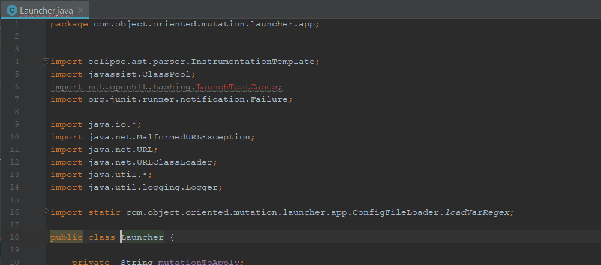
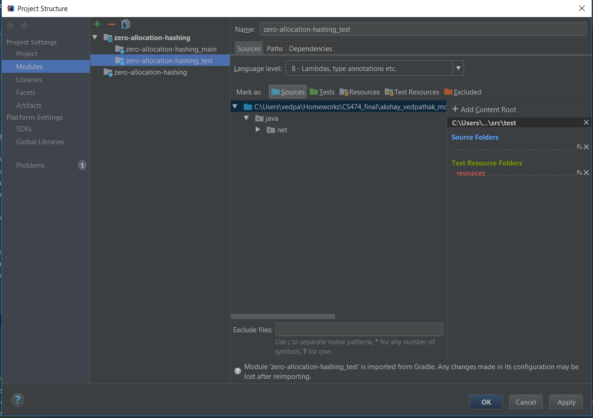
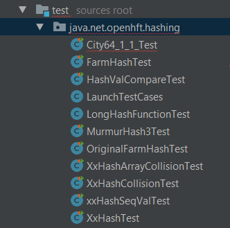
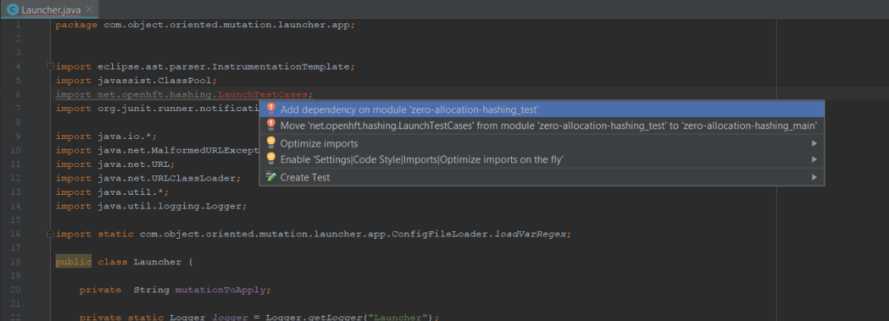
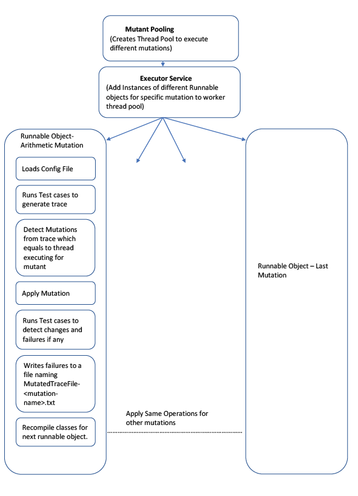

* This project was implemented as part of my course work at Grad school where we were asked to implement mutation testing using javassist. The mutation testing was performed on the following project (https://github.com/OpenHFT/Zero-Allocation-Hashing)

# Mutation Testing using Javassist #

## Steps for setting up the project ##
- Checkout project from Bitbucket (https://bitbucket.org/sylvestersavioraj/akshay_vedpathak_mohammed_noman_mulla_sylvester_raj_hw3)
- Open the project in Intellij
- If you get the following error

- Rightclick on the project and open module settings
- Apply the following settings as shown below;

- Now rename test package shown below to `net.openhft.hashing`

- Hover over the error in Launcher.java and add the dependency as highlighted below;

- Once you do that a prompt that's shown below will be displayed 

- Click OK to add the dependency

## Steps for Gradle Build ##

- Right click on the build.gradle file and select "Run build"

## Steps for SBT Build ##

- Open terminal, from the project root directory (zero-allocation-hashing) run the following commands

    `sbt clean`
    
    `sbt run`
    
## Running the application ##

- Run the Class com.object.oriented.mutation.launcher.app.MutantPooling.java

## Mutations applied in the project ##

- Access modifier change: (AccessModifierMutant.java)
This mutant reads the class level fields on the specified class and changes the access modifiers of all the fields to public static

- Method Rename: (MethodMutant.java)
This mutant reads all the declared methods in a specified class and renames them

- Hidden variable deletion: (InheritanceMutant.java)
This mutant reads all the hidden fields from the subclasses of a specified class and then deletes those hidden fields from the subclass

- Overridden Method modification: (MethodInvocationMutant.java)
This mutant finds all the overridden methods in the subclasses of a super class and modifies the overridden method's body 
with just a call to the super class method

- Arithmetic/Conditional/Assignment Operation modification: (TransformByteCode.java)
This mutant scans the bytecode for the specified class and using the opCodes for bytecode instructions 
it performs the below mentioned mutations;

    - Arithmetic Operation Mutation: a+b mutates to a-b etc.
    - Conditional Operation Mutation: a<b mutates to a>b etc.
    - Assignment Operation Mutation: a+=b mutates to a-=b etc.

## Structure of the project ##

The high level structure of the project implementation is as below;

